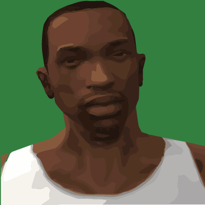

# SA:MP Forum Discord Bot

CJ verifies Burgershot (formerly SA:MP) forum accounts and performs other tasks if you ask nicely.

Not really in development and not accepting new features. I fix bugs from time to time but it serves it purpose as a
verification tool and basic forum interface.

## Development

This project is open to anyone who wants to contribute, large or small! Whether you noticed a typo or want to add a
whole new feature, go for it!

Large additions should be discussed in issues or on Discord first. If you're new to Golang, ask me on Discord for where
to start and you can use CJ as a starting point for a contribution.

### Testing/Workflow

To run the app, you need:

- A Discord server to test - you can't use the SA:MP Discord to do tests
- Go 1.11 - no guarantees on older versions

If you don't own/admin a Discord server, creating one is simple, you can do it from the same menu you join discord
servers from.

#### Running with a database

If you want to develop features that require persisting data, spin up a MongoDB database. If you have Docker installed,
this is as simple as running `make mongodb` which will start a MongoDB container with a user `root` that has no
password. If you don't have Docker, you'll need to
[install MongoDB onto your system.](https://docs.mongodb.com/manual/installation/).

#### Running without a database

If you don't need a database for your feature, just add `NO_DATABSE=true` to `.env`.

Finally, the application requires some configuration. Copy the `example.env` to `.env` and modify it to use your token
and various IDs. Depending on what you're working on, some values won't be necessary. For example, unless you're
actually working on the verification system, you don't need to set the verified role ID.

Now you can build and run the application with `make local`.

## Contributors ✨

Thanks goes to these wonderful people ([emoji key](https://allcontributors.org/docs/en/emoji-key)):

<!-- ALL-CONTRIBUTORS-LIST:START - Do not remove or modify this section -->
<!-- prettier-ignore -->
<table><tr><td align="center"><a href="https://wopss.net"> <b>Octavian Dima</b></a> <a href="https://github.com/Southclaws/cj/commits?author=WopsS" title="Code">💻</a> <a href="#ideas-WopsS" title="Ideas, Planning, & Feedback">🤔</a> <a href="https://github.com/Southclaws/cj/issues?q=author%3AWopsS" title="Bug reports">🐛</a></td><td align="center"><a href="https://github.com/J0shES"> <b>J0shES</b></a> <a href="https://github.com/Southclaws/cj/commits?author=J0shES" title="Code">💻</a> <a href="#ideas-J0shES" title="Ideas, Planning, & Feedback">🤔</a> <a href="https://github.com/Southclaws/cj/issues?q=author%3AJ0shES" title="Bug reports">🐛</a> <a href="#maintenance-J0shES" title="Maintenance">🚧</a></td><td align="center"><a href="https://github.com/Dayvison"> <b>Dayvison</b></a> <a href="https://github.com/Southclaws/cj/commits?author=Dayvison" title="Code">💻</a></td><td align="center"><a href="https://adriangraber.com"> <b>Adrian Graber</b></a> <a href="https://github.com/Southclaws/cj/commits?author=AGraber" title="Code">💻</a></td><td align="center"><a href="https://github.com/Sreyas-Sreelal"> <b>__SyS__</b></a> <a href="https://github.com/Southclaws/cj/commits?author=Sreyas-Sreelal" title="Code">💻</a></td><td align="center"><a href="https://gigabitz.pw"> <b>Robster</b></a> <a href="#content-Gigabitzz" title="Content">🖋</a></td><td align="center"><a href="https://twitter.com/dakyskye"> <b>Lasha Kanteladze</b></a> <a href="https://github.com/Southclaws/cj/commits?author=dakyskye" title="Code">💻</a> <a href="https://github.com/Southclaws/cj/commits?author=dakyskye" title="Tests">⚠️</a> <a href="#ideas-dakyskye" title="Ideas, Planning, & Feedback">🤔</a></td></tr><tr><td align="center"><a href="https://kristo.xyz"> <b>Kristo Isberg</b></a> <a href="https://github.com/Southclaws/cj/commits?author=kristoisberg" title="Code">💻</a> <a href="https://github.com/Southclaws/cj/commits?author=kristoisberg" title="Tests">⚠️</a> <a href="#ideas-kristoisberg" title="Ideas, Planning, & Feedback">🤔</a></td><td align="center"><a href="https://marcelschr.me"> <b>Marcel Schramm</b></a> <a href="https://github.com/Southclaws/cj/commits?author=Bios-Marcel" title="Code">💻</a></td><td align="center"><a href="https://github.com/thecodeah"> <b>Codeah</b></a> <a href="https://github.com/Southclaws/cj/commits?author=thecodeah" title="Code">💻</a></td><td align="center"><a href="https://github.com/GiampaoloFalqui"> <b>Giampaolo Falqui</b></a> <a href="https://github.com/Southclaws/cj/commits?author=GiampaoloFalqui" title="Documentation">📖</a></td><td align="center"><a href="https://github.com/Sunehildeep"> <b>Sunehildeep</b></a> <a href="https://github.com/Southclaws/cj/commits?author=Sunehildeep" title="Code">💻</a></td><td align="center"><a href="https://redcountyrp.com"> <b>TommyB</b></a> <a href="#content-TommyB123" title="Content">🖋</a></td><td align="center"><a href="https://github.com/Hual"> <b>Nikola Yanakiev</b></a> <a href="#content-Hual" title="Content">🖋</a></td></tr></table>

<!-- ALL-CONTRIBUTORS-LIST:END -->

This project follows the [all-contributors](https://github.com/all-contributors/all-contributors) specification.
Contributions of any kind welcome!
